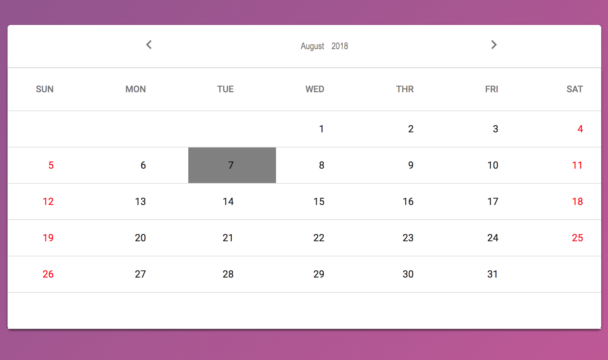
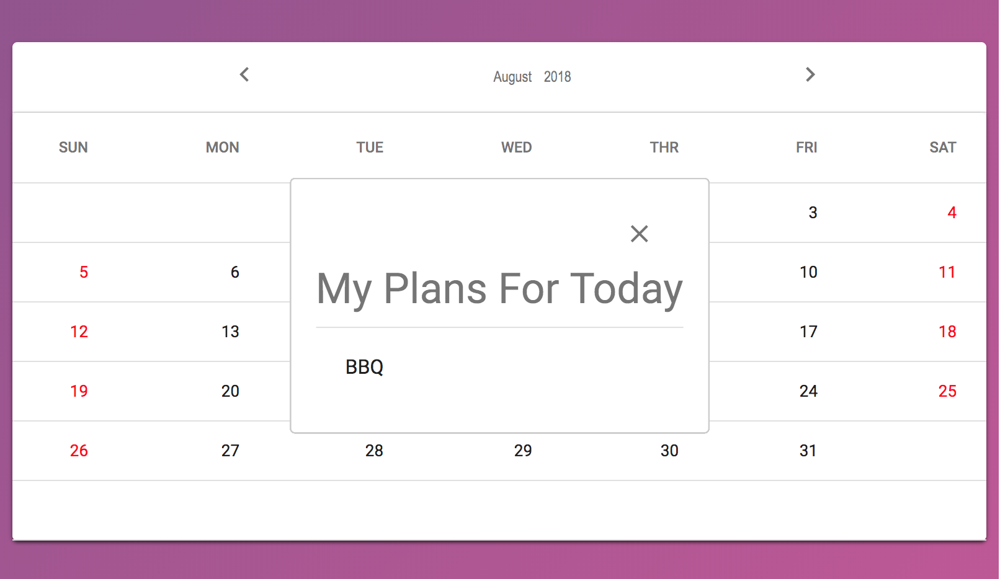
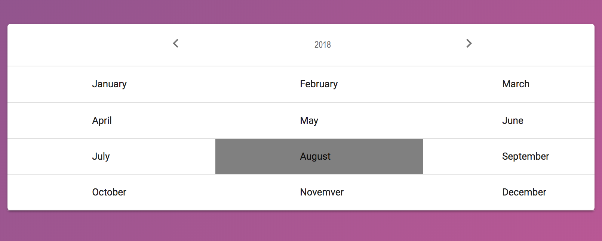

# React Material-Ui Calendar

 This is a calendar used by React and Material-Ui.

  

You find a demo here:

* https://react-material-ui-calendar.herokuapp.com/

## Usage

* Press a certain day in caledar, you can see your plans of the day. In demo, clicking a specific day, you see "BBQ" for your plans of the day ;) 



 (If you build the backend for your schedule (i.e. building your own API), you can fetch your actual plans from the API and show these plans in the modal window.)

* Press the tile for month (June 2018) at the header in caledar, you can see all months of a year and choose the month which you want to see. 



## Getting Started

### Prerequisites

* node => v9.3.0
* npm

## 1. Installing

Run the following command to install the dependencies.

```
$ npm install
```

### 2. Starting Client-Side Application

Run the folloing command to start the client-side application.

```
$ npm run hack
```

=> You'll see the app on http://localhost:8080!

### 5. Techlonologies Used

  * JavaScript (ES6)
  * React
  * Material-Ui
  * Heroku